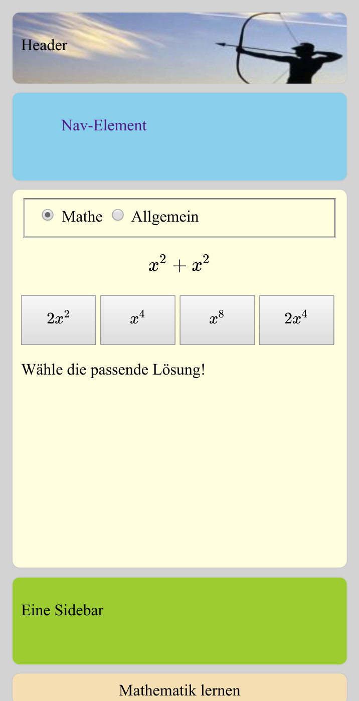

# Beleg webbasiertes Lernprogramm

## Übersicht
Als Beispiel für eine Progressive Web App (PWA) soll ein webbasiertes Programm zur Überprüfung allgemeiner bzw. Mathematikkenntnisse erstellt werden.
Der Beleg dient zur praktischen Anwendung der Kenntnisse zu HTML, CSS und Javascript. Die Umsetzung als PWA ermöglicht auch die einfache und komfortable Nutzung in mobilen Geräten. 


## Beschreibung
Das Lernprogramm soll mindestens folgende Funktionalität besitzen:
- zufällige Auswahl und Darstellung einer Aufgabe mit 4 Auswahlmöglichkeiten
- Anzeige des Lernfortschritts
- Wahl zwischen mindestens 2 verschiedenen Aufgabenkategorien (Kategorien Mathematik und Allgemein sind Pflicht)
- Anzeige einer Statistik am Ende eines Durchlaufs
- die Anzeige sollte sich an verschiedene Anzeigegeräte (Browser des PCs, Smartphone) sinnvoll anpassen

## Technische Umsetzung
- nutzen Sie für die Umsetzung HTML5/CSS3/JS 
- nutzen Sie in JS den strikten Modus 
- der Beleg sollte im aktuellen Firefox oder Google Chromium lauffähig sein, es wird keine Abwärtskompatibilität erwartet
- entsprechend einer PWA sollte die Anwendung auf einem Smartphone installieren lassen
- normalerweise benötigt man in einer PWA einen Service Worker zur Steuerung des Caches, in diesem Beleg können Sie den Service Worker aber weglassen, die App lässt sich trotzem installieren
- verwenden Sie **keine** weiteren Frameworks wie jquery, Bootstrap etc., sondern nutzen Sie die Funktionalität von ECMAScript und CSS3 in den aktuellen Browsern
- Als Entwicklungsumgebung empfiehlt sich die Nutzung der Entwickertools im Browser Chromium
- zum Testen der Funktionalität auf einem Smartphone kann die Device Toolbar in o.g. Entwickertools genutzt werden
- für die grafische Formeldarstellung (Rendering) sollte die JS-Bibliothek [KaTeX](https://github.com/KaTeX/KaTeX) genutzt werden, siehe [Beispiel](mathe-demo.html)
- das Format der vom Server nachladbaren Fragen ist JSON entsprechend folgendem Fragment (a - Aufgabe, l - Lösungen, die erste ist korrekt ):
```
{ 
  "teil-mathe": [
    {"a":"x^2+x^2", "l":["2x^2","x^4","x^8","2x^4"]},
    {"a":"x^2*x^2", "l":["x^4","x^2","2x^2","4x"]}
    ]
  "teil-allgemein": [
    {"a":"Karl der Große, Geburtsjahr", "l":["747","828","650","1150"]},
   ...
    ]  
}
```


## Mögliche Erweiterungen (optional)
- neue Lernmodule sollten sich von einem Webserver per Ajax laden lassen
- vom Server http://idefix.informatik.htw-dresden.de/it1/beleg/ können die Beispielaufgaben mathe-aufgaben.js geladen werden (Zugriff nur innerhalb des HTW-Netzes möglich). 
- Erweiterung um einen Service-Worker zum Cachehandling um die Anwendung auch offline nutzbar zu machen
- Wichtung der Aufgabenstellung anhand der bisherigen Ergebnisse

## Prinzipdarstellung

Um einen Eindruck zu vermitteln, wie die Darstellung auf einem Smartphone aussehen könnte, ist nachfolgend eine Demoversion zu sehen.
Die HTML-Elemente wurden für den kleinen Viewport mittels CSS-Mediaqueries untereinander dargestellt. Auf einem Desktopbrowser würde die Darstellung teilweise nebeneinander erfolgen. Die Darstellung dient nur zur Orientierung. Sie können eine abweichende Oberfläche erstellen.
Der Screenshot würde mit den Entwicklertools des Browsers erstellt.


<!---     --->
