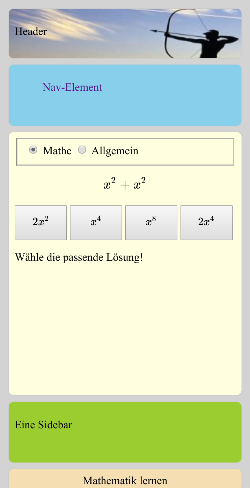

# Beleg webbasiertes Lernprogramm

## Übersicht
Wesentliche Aufgabe des Belegs ist die Erstellung eines  webbasierten Lernprogramms. Als Fundament nutzen wir die Technik der Progressive Web App (PWA).
Der Beleg dient der praktischen Anwendung der Kenntnisse zu HTML, CSS, Javascript sowie einer Server-API. Die Umsetzung als PWA ermöglicht auch die einfache und komfortable Nutzung in mobilen Geräten. 

## Lernaspekte des Beleges
- Nutzung von HTTP/HTTPS
- Einsatz von HTML zur Strukturierung
- Einsatz von CSS zur Formatierung 
- Webprogrammierung mittels Javascript (ECMAScript)
- Nutzung des DOMs (Document Object Model)
- Wahl einer geeigneten Softwarearchitektur 
- Nutzung einer JS-Bibliothek zur Darstellung von speziellen Inhalten
- Entwurf und Implementierung eines sinnvollen Nutzerinterfaces
- Implementierung eines responsive Designs für unterschiedliche Geräte/Bildschirmgrößen
- Nutzung der Technik einer PWA
- Offline-Nutzung einer Webapp
- dynamisches Nachladen von Inhalten mittels Ajax-Technik
- Datenübertragung mittels JSON-Format
- Nutzung einer REST-Schnittstelle mit vorgegebener API
- Datenspeicherung auf dem Server mittels PHP und SQLite

## Beschreibung
Das Lernprogramm soll mindestens folgende Funktionalität besitzen:
- Wahl zwischen verschiedenen lokal gespeicherten Aufgabenkategorien 
- zufällige Auswahl und Darstellung einer Aufgabe mit 4 Auswahlmöglichkeiten (zufällig zusammengestellt)
- Anzeige des Lernfortschritts nach jeder Aufgabe mittels Progressbar
- Anzeige einer Statistik am Ende eines Durchlaufs
- die Anzeige sollte sich an verschiedene Anzeigegeräte (PC-Browser, Tablet, Smartphone) sinnvoll anpassen (responsive Design)

## Aufgabenkategorien
Folgende Kategorien stehen zur Auswahl:
- Internet-/ Webtechnologien
- Mathematikaufgaben (rendern mittels JS-Bibliothek [KaTeX](https://github.com/KaTeX/KaTeX), siehe [Beispiel](demos/mathe-demo.html))
- Noten lernen (rendern mittels JS-Bibliothek [Vexflow](https://github.com/0xfe/vexflow) / EasyScore)
- eine Aufgabenkategorie, bei welcher die einzelnen Aufgaben von einem bereitgestellten externen Server mittels [Ajax und REST-API](#rest-schnittstelle-des-externen-aufgabenservers) geholt werden


## Technische Umsetzung
- nutzen Sie für die Umsetzung HTML5/CSS3/JS 
- nutzen Sie in JS den strikten Modus 
- der Beleg sollte in den aktuellen Browsern Firefox und Google Chrome/Chromium lauffähig sein, es wird keine Abwärtskompatibilität erwartet
- entsprechend einer PWA sollte sich die Anwendung auf einem PC/Smartphone installieren und offline nutzen lassen (PC-Installation funktioniert aktuell nur bei Chrome/Chromium)
- man benötigt in einer PWA ein Manifest und einen Service Worker zur Steuerung des Caches für den Offline-Betrieb und die Installation (die Offline-Funktionsfähigkeit testen Sie mit den Entwicklertools von Chrome/Chromium - Application - Service workers - offline anklicken, danach muss sich die Seite neu laden lassen)
- verwenden Sie **keine** weiteren Frameworks wie jquery, Bootstrap etc., sondern nutzen Sie die Funktionalität von ECMAScript und CSS3 in den aktuellen Browsern (TypeScript ist für Entwickler mit Vorkenntnissen erlaubt)
- Als Entwicklungsumgebung empfiehlt sich die Nutzung der Entwickertools im Browser Chromium oder Firefox
- zum Testen der Funktionalität auf einem Smartphone kann die Device Toolbar in o.g. Entwickertools genutzt werden
- die Fragen der einzelnen Kategorien sind im JSON-Format abzulegen, nachfolgend ein Beispiel (a - Aufgabe, l - Antworten, die erste ist immer korrekt, bei der Anzeige sind die Antworten sinnvollerweise zu verwürfeln ;-) ):
```
{ 
  "mathe": [
    {"a":"x^2+x^2", "l":["2x^2","x^4","x^8","2x^4"]},
    {"a":"x^2*x^2", "l":["x^4","x^2","2x^2","4x"]}
    ]
  "web": [
    {"a":"Welche Authentifizierung bietet HTTP", "l":["Digest Access Authentication","OTP","OAuth","2-Faktor-Authentifizierung"]},
    {"a":"Welches Transportprotokoll eignet sich für zeitkritische Übertragungen", "l":["UDP","TCP","HTTP","Fast Retransmit"]},
   ...
    ]  
  "allgemein": [
    {"a":"Karl der Große, Geburtsjahr", "l":["747","828","650","1150"]},
   ...
    ]
  "noten": [
    {"a":"C4", "l":["C","D","E","H"]},
    {"a":"(C4 E4 G4)", "l": ["C", "H", "F", "D"]},
   ...
    ]       
}
```

## REST-Schnittstelle des externen Aufgabenservers
- Es soll im Beleg die Möglichkeit bestehen, neben den internen Aufgaben weitere Aufgaben von einem externen Server mittels REST zu laden.
- genutzt wird das Projekt [Web-Quiz](https://github.com/swsms/web-quiz-engine) mit der entsprechenden API für das Holen der Aufgabe und die Überprüfung der Lösung.
- Das Web-Quiz-Projekt ist bereits fertig auf einem Server der Informatik gehostet. Die Eckdaten dieses Servers werden in der Lehrveranstaltung bekannt gegeben bzw. finden Sie im [Chat](https://imessage.informatik.htw-dresden.de/channel/webprogrammierung)
- es sind u.U. bereits Aufgaben vorhanden, welche Sie nutzen können
- Sie sollten mit Ihrem eigenen Account auch einige Aufgaben hochladen
- per AJAX-Request muss lediglich die Aufgabe geholt werden und das Ergebnis überprüft werden, alle anderen notwendigen Aufgaben (Nutzer + Aufgaben anlegen) können außerhalb des Lernprogramms per CURL erledigt werden
- Befüllen Sie die Datenbank am besten per Script, so können Sie Ihre Daten auch im Falle eines Problems schnell wieder auffüllen.


## Vorschlag für Vorgehen bei der Bearbeitung
- Erstellung des HTML-Gerüstes mit allen Elementen
- Nutzung von CSS zur Gestaltung + Responsive Design
- Erstellung der Javascript-Programmstruktur (Architektur Model-View-Presenter empfohlen)
- Implementierung einer geeigneten Model-Schnittstelle zum Erhalt der Aufgabe und zur Übergabe der gewählten Lösung (zunächst mit einfacher Dummy-Frage)
- Implementierung der Button-Handler, welche die Auswertefunktion des Presenters aktivieren
- Erweiterung des Models auf verschiedene Aufgaben mit Zufallsfunktion
- Implementierung der Statistikfunktionalität
- Erweiterung der Anzeige auf andere Aufgabentypen (Mathe -> Katex, etc.)
- Erweiterung des Models um die Nutzung der angebotenen REST-Schnittstelle
- Offlinefunktionalität implementieren


## Weitere Anforderungen
- falls Sie ChatGPT u.ä. nutzen, müssen Sie dies dokumentieren und den erstellten Code erklären können
- Dokumentation des Projektes, so dass eine andere Person ggf. am Projekt weiterarbeiten könnte
- Legen Sie eine Datei README.md an mit relevanten Informationen zum Beleg: erfüllte Aufgaben, eventuelle Probleme, genutzter Browser, ...

## Mögliche Erweiterungen (optional)
- Wichtung der Aufgabenstellung anhand der bisherigen Ergebnisse
- Erweiterung auf mögliche Mehrfachauswahl
- zusätzliche Kategorie Notenlernen vorsehen (einzelne Note / Akkorde / Umkehrungen ganz nach Belieben / Klaviatur).
- Speicherung der erreichten Punkte im Browserspeicher oder per PHP-Script auf dem Server
- Mehrnutzerbetrieb mit Nutzerauthentifizierung 

  
## Links
- [KaTeX](https://github.com/KaTeX/KaTeX) 
- [Web-Quiz](https://github.com/swsms/web-quiz-engine) 
- [Fehlersuche - Stackoverflow](https://stackoverflow.com)


## Prinzipdarstellung
Die Darstellung unten zeigt prinzipiell, wie der Beleg auf einem Smartphone aussehen könnte. Sie sind nicht an die Darstellung gebunden.
Die HTML-Elemente wurden für den kleinen Viewport mittels CSS-Mediaqueries untereinander dargestellt. Auf einem Desktopbrowser würde die Darstellung teilweise nebeneinander erfolgen. Die Darstellung dient nur zur Orientierung. Sie können eine abweichende Oberfläche erstellen.
Der Screenshot wurde mit den Entwicklertools des Browsers erstellt.


